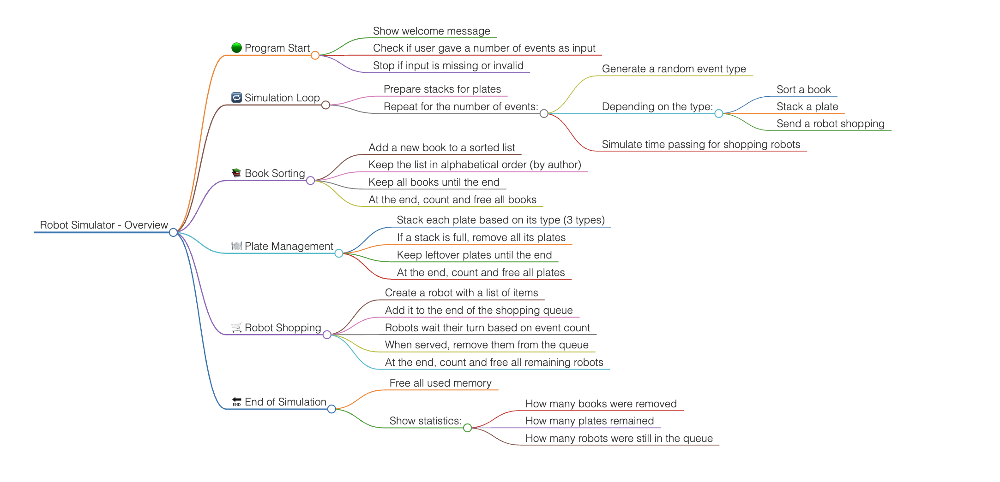

# 
 Practical project 1
##### 
 Fundamentals of programming II

###### 
 Gússem Yahia-Cheikh and Sara Díez

###### 
 NIUs: 1746001 / 1706988

### First steps

First of all, before starting programming directly, we wanted to adress the whole problem and see what were the structure of creation to archive the desired result. So we started by making an schema/flowchart of the whole program and the steps we wanted to follow.

### Strategy and Steps
We decide to divide the work by functionality provided each 'exercice' in the pdf, so the three main areas to work on are:
- Books 
- Plates
- Shopping
  
##### **Argument Management**

So from there we started by the initial phase of the program, the input and the managment of it. The function `void CheckArguments (int argc, char *argv)` checks the number of arguments is correct and that the second argument \( \in \mathbb{R}\). If the conditions are satisfied we stored the value in `EventNumbers`.

##### **Event Loop Setup**
Then we attacked the `void SimulationLoop(int EventNumbers)`, the structure we followed to code the function was:
1. Loop over the number of events
2. Generate a random event type (0,1 or 2)
3. On each iteration we delegate it corresponding type:
   1. Type 0: Package sortment
   2. Type 1: Package classification
   3. Type 2: Shopping
4. And finally simulating the time passing after each event ( `UpdateShoppingQueue()` )

##### **Task 1: Package managment**
Now let's address the package managment block, here we will work with sorted linked lists ordered by `suppliers` (taking in count that the `RobotPackage` contains a `supplier`, `id` and `year`). 
We have three functions working in this block: `PrintRobotPackages()`, `SearchRobotPackage()` and `SimulateManagingRobotPackages()`.
 
##### **Task 2: Package Classification (Stacks)**
##### **Task 3: Shopping (Queue and Time)**
##### **Fine Tuning (Cleanup and Testing)**

### Problems and criticisms

### Output Sampling

